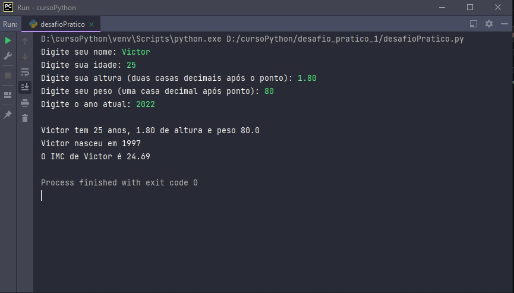

# 1º Desafio pratico de python 

### Hi there ! 👋🏽

Neste repositorio apresento minha solução para o desafio prático do curso de python 3 do básico ao avançado (com projetos reais) na plataforma Udemy.

Requisitos para o desafio: 

* Criar variaveis para nome (str), idade(int)
* altura(float) e peso (float) de uma pessoa
* Criar variavel com o ano atual (int)
* Obter o ano de nascimento da pessoa (baseado na idade e no ano atual)
* Obter o IMC da pessoa com 2 casas decimais (peso e na altura da pessoa)
* Exibir um texto com todos os valores na tela usando F-Strings (com as chaves)

### Deploy da aplicação 

Para realização do desafio foi utilizando a IDE Pycharm. 

Aplicação Run:
 

